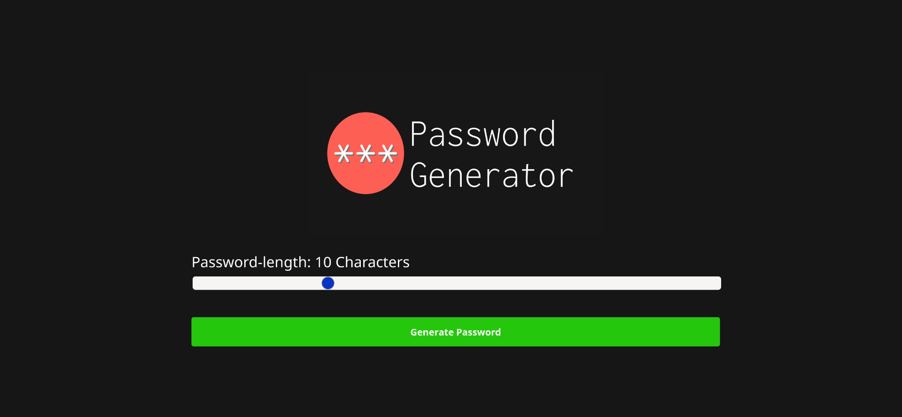
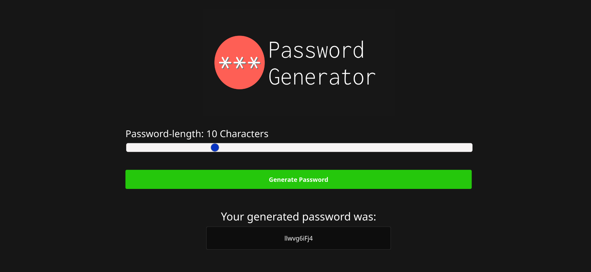
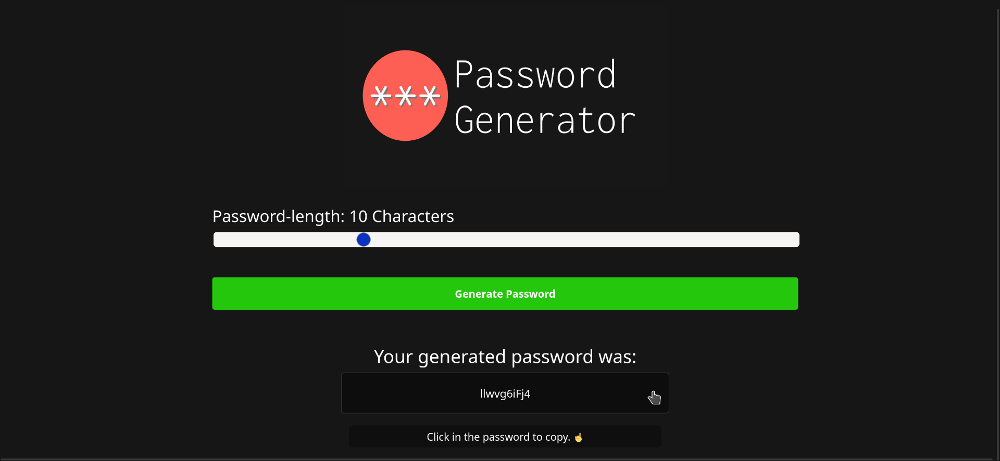

Este é um gerador de senhas automático desenvolvido em HTML, CSS e JavaScript. Dado o tamanho desejado da senha, ele retorna uma senha aleatória com esse tamanho.Feito com o objetivo de aprimorar minhas habilidades com essas tecnologias.

## Funcionalidades

- Gera senhas aleatórias com o tamanho especificado pelo usuário.
- Interface simples e fácil de usar.

## Tecnologias Utilizadas

- HTML
- CSS
- JavaScript

## Como Usar

1. Clone este repositório:
    ```
    git clone https://github.com/jrosac/Password-generator.git
    ```

2. Abra o arquivo `index.html` no seu navegador web.

3. Insira o tamanho desejado para a senha e clique no botão "Gerar Senha".

4. A senha gerada será exibida na tela.

5. Clique na senha para copia-la para sua área de transferência.

## Demonstrações Visuais

### Interface do usuário

Interface inicial do usuário ao abrir a aplicação, contém a logo do gerador de senhas("Password Generator"), logo abaixo se encontra o slider para o usário indicar o tamanho da senha que ele deseja e embaixo do slider se encontra o botão a ser pressionado para se gerar a senha("Generate Password").

### Funcionalidade de geração de Senha

Interface após o usario selecionar o tamanho da senha e clicar em gerar senha, após o botão ser pressionado aparecerá a legenda "Your password was:" e logo abaixo dela com uma cor de fundo preta será mostrada a senha aleatoria gerada.

### Funcionalidade de copiar senha

Infarce após a senha ser gerada e o usuário passar o mouse em cima dela, após o usario passar o mouse será mostrada uma legenda abaixo indico que ao clicar na senha ela será copiada ("Click in the password to copy. ☝️"), após o usuário seguir o passo da legenda e clicar na senha ela será copiada para a área de transferência.

## Contribuindo

Contribuições são bem-vindas! Sinta-se à vontade para abrir um Pull Request ou uma Issue se encontrar algum problema ou tiver sugestões de melhorias.